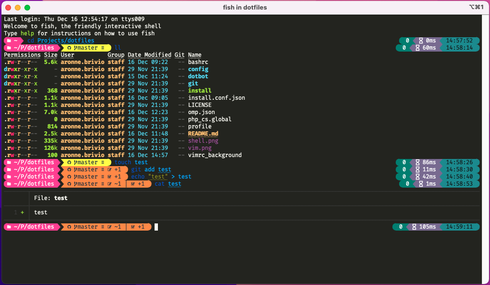
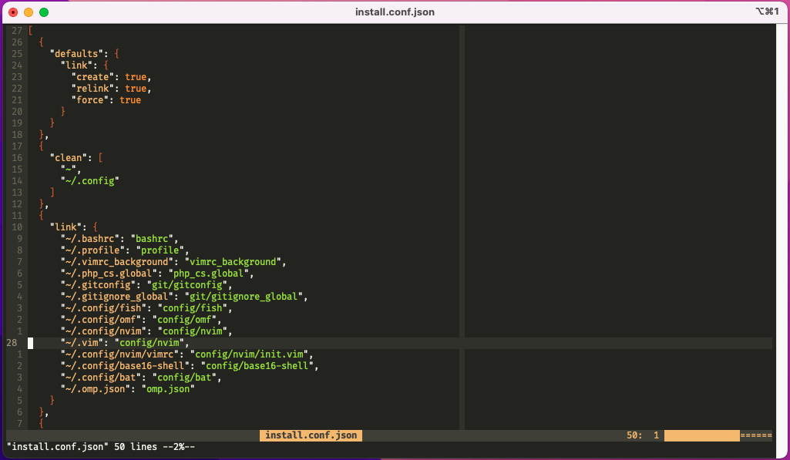

# ⚙️ Dotfiles
> It seems that after years without *git-ing* my dotfiles, I finally made up my mind! 🎉

This repository includes configuration files for:

- [fish shell](https://fishshell.com/) (w/ aliases and functions)
  - [Oh My Fish](https://github.com/oh-my-fish/oh-my-fish)
  - [fisher](https://github.com/jorgebucaran/fisher)
  - [bobthefish](https://github.com/oh-my-fish/theme-bobthefish) theme
  - [base16](https://github.com/chriskempson/base16-shell) colors support
  - [bat](https://github.com/sharkdp/bat)
  - [colorls](https://github.com/athityakumar/colorls) support
  - [node](https://nodejs.org/) via [fish-nvm](https://github.com/jorgebucaran/fish-nvm)
- [Neovim](https://neovim.io/)
  - tons of plugins (w/ [vim-plug](https://github.com/junegunn/vim-plug))
  - some key remaps
- [Vim](https://www.vim.org/)
  - use Nvim configuration (thanks to [laggardkernel](https://gist.github.com/laggardkernel/9013f948345212563ede9c9ee56c6b42))
- [git](https://git-scm.com/)
  - global `.gitignore` and config
  - some fancy aliases

Once cloned, run `./install` to automatically set up the development environment.
*Note that the install script is idempotent: it can safely be run multiple times.*

Dotfiles uses [Dotbot](https://github.com/anishathalye/dotbot) for installation.

## Local Customizations
This project supports **computer specific customizations** for some programs:

- fish shell:
  - `config/fish/aliases/local.fish` for local aliases
  - `config/fish/env/local.fish` for local environment
  - `config/fish/local.fish` for other local configurations
- git: `~/.gitconfig_local` for local configurations and aliases

For my personal local configurations head to [dotfiles-local](https://github.com/aronnebrivio/dotfiles-local).

## Result

## ToDo
- [x] Fish configuration
- [x] Nvim configuration
- [x] Git configuration
- [x] Support local customizations
- [x] Use Nvim configuration in Vim
- [ ] SSH configuration

## License
Copyright (c) 2020 Aronne Brivio. Released under the MIT License. See [LICENSE](https://github.com/aronnebrivio/dotfiles/blob/master/LICENSE) for details.

